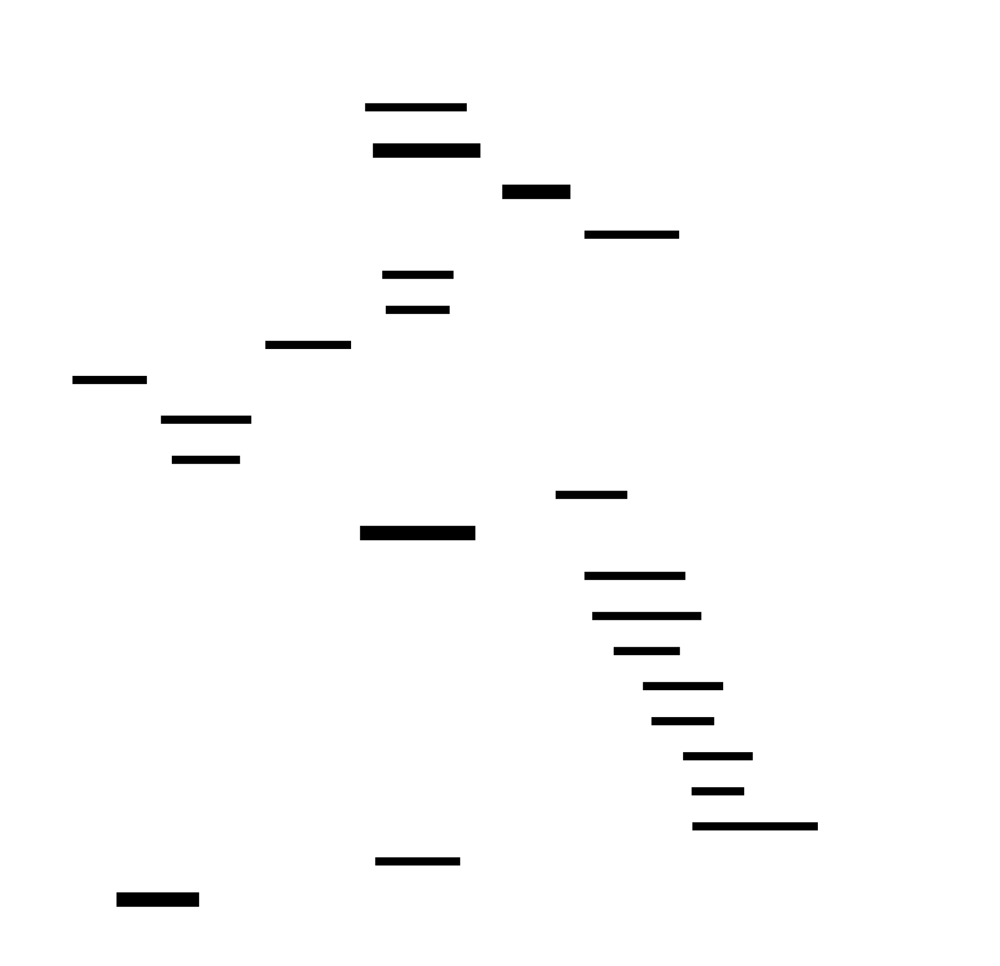

# Enterprise Web Application — AWS Architecture Plan (ECS + Fargate)

## Executive Summary

Este documento describe la arquitectura de referencia para una **aplicación web empresarial multi-tier y de alta disponibilidad** desplegada en AWS, utilizando **Amazon ECS con Fargate** como capa de cómputo para el tier de aplicación (Tomcat / JBoss). A diferencia de la variante EC2 clásica, Fargate elimina por completo la gestión de instancias: no hay OS que parchear, no hay Launch Templates, ni AMIs que mantener. El backend de datos sigue siendo **Amazon Aurora Serverless v2**, desplegado en configuración Multi-AZ.

> Esta arquitectura es la evolución natural de la variante EC2 cuando el equipo quiere **reducir el overhead operacional** sin sacrificar control sobre red, seguridad o escalabilidad.

### Comparativa con la variante EC2

| Aspecto | EC2 + Auto Scaling | **ECS + Fargate** |
|---|---|---|
| Gestión de OS | Manual (SSM Patch Manager) | **AWS managed — ninguna** |
| Unidad de escalado | Instancia EC2 | **Tarea ECS (container)** |
| Empaquetado de la app | JAR/WAR en AMI | **Docker image en ECR** |
| Rol IAM en cómputo | Instance Profile | **Task Role + Execution Role** |
| Security Group aplicado | ENI de la instancia | **ENI de la tarea Fargate** |
| Tiempo de escala | ~3–5 min (nueva instancia) | **~30–60 s (nueva tarea)** |
| Coste de cómputo | Instancia siempre activa | **Por-segundo, solo CPU/RAM usados** |

---

## System Context

> Visión de alto nivel del sistema y sus actores externos.


### Key Components

| Actor / System | Descripción |
|---|---|
| **End Users** | Usuarios finales que acceden a la aplicación desde un navegador web mediante HTTPS. |
| **Enterprise Web Application** | Sistema completo en AWS: WAF, ALB, ECS Cluster (Fargate), Aurora DB y servicios de soporte. |
| **DevOps / Ops Team** | Ingenieros que construyen imágenes Docker, las publican en ECR, y despliegan nuevas revisiones de la ECS Task Definition mediante un pipeline CI/CD. |
| **Amazon ECR** | Registro privado de imágenes Docker. Almacena las imágenes versionadas de Tomcat/JBoss. |
| **Amazon CloudWatch** | Plataforma de observabilidad regional: métricas, logs de contenedor (driver `awslogs`), alarmas. |
| **AWS IAM** | Proporciona el **Task Execution Role** (para ECR pull y CloudWatch Logs) y el **Task Role** (para Secrets Manager y otras APIs de aplicación). |

### Decisiones de diseño

- **Workflow de despliegue**: el equipo hace `docker push` a ECR, crea una nueva revisión de la Task Definition, y actualiza el ECS Service. ECS realiza un rolling update con health checks antes de drenar las tareas antiguas.
- **Separación de roles IAM**: el Execution Role es asumido por el agente ECS (control plane); el Task Role es asumido por el proceso dentro del contenedor. Principio de mínimo privilegio en dos capas.

---

## Architecture Overview

```
Internet → WAF → ALB (subnets públicas) → Fargate Tasks/Tomcat (subnets privadas app) → Aurora Serverless v2 (subnets privadas DB)
                                                      ↑
                                              ECR (VPC Endpoint)
```

| Tier | AWS Service | Tipo de Subnet |
|---|---|---|
| Edge / Seguridad | AWS WAF + ACM | N/A (servicio regional gestionado) |
| Load Balancing | Application Load Balancer | Pública (Multi-AZ) |
| Aplicación | ECS Fargate (Tomcat/JBoss) | Privada App (Multi-AZ) |
| Base de Datos | Aurora Serverless v2 | Privada DB (Multi-AZ) |

---

## Component Architecture

> Componentes internos, responsabilidades e interacciones.


### Key Components

| Componente | Responsabilidad |
|---|---|
| **AWS WAF** | Evalúa cada petición HTTPS contra AWS Managed Rules (OWASP Top 10, IP reputation, rate-limiting). Bloquea amenazas antes del ALB. |
| **AWS Certificate Manager (ACM)** | Emite y renueva automáticamente el certificado TLS público vinculado al listener HTTPS del ALB. |
| **SG-ALB** | Security Group del ALB. Permite inbound TCP 443 y 80 desde `0.0.0.0/0`. Outbound a SG-TASK en puerto 8080 únicamente. |
| **Application Load Balancer** | Terminación TLS, redireccionamiento HTTP→HTTPS, distribución round-robin a **IPs de tareas Fargate** (target group de tipo IP, no instancia). |
| **ECS Cluster (Fargate)** | Agrupación lógica para las tareas. Usa el launch type Fargate: sin servidores que gestionar. |
| **ECS Service** | Mantiene el número deseado de tareas (mínimo 2). Integra Application Auto Scaling (Target Tracking en CPU/Memory). Realiza rolling updates sin downtime. |
| **Fargate Task (Tomcat/JBoss)** | Contenedor con la aplicación Java EE. Asume el Task Role para llamadas a Secrets Manager. Envía logs mediante el driver `awslogs` a CloudWatch Logs. |
| **SG-TASK** | Security Group aplicado a la ENI de cada tarea Fargate. Inbound: TCP 8080 solo desde SG-ALB. Outbound: TCP 3306/5432 a SG-DB; TCP 443 a VPC Endpoints. |
| **Amazon ECR** | Registro privado. Almacena imágenes Docker versionadas. Escaneo de vulnerabilidades en cada push. Política de lifecycle para retener solo las últimas N imágenes. |
| **IAM Execution Role** | Asumido por el agente ECS. Permisos: `ecr:GetAuthorizationToken`, `ecr:BatchGetImage`, `logs:CreateLogStream`, `logs:PutLogEvents`. |
| **IAM Task Role** | Asumido por el proceso dentro del contenedor. Permisos mínimos: `secretsmanager:GetSecretValue` para las credenciales de DB. |
| **Aurora Serverless v2 (Writer)** | Instancia primaria en AZ-1. Gestiona escrituras DDL/DML y lecturas consistentes. Escala de 0.5 a 32 ACU sin reinicio ni pérdida de conexiones. |
| **Aurora Serverless v2 (Reader)** | Réplica de lectura en AZ-2. Distribuye queries SELECT. Failover automático a Writer en < 30 s. |
| **SG-DB** | Permite inbound TCP 3306 (MySQL) o 5432 (PostgreSQL) solo desde SG-TASK. Sin reglas outbound. |
| **AWS Secrets Manager** | Almacena credenciales de BD. Rotación automática cada 30 días. Las tareas Fargate las recuperan vía Task Role a través del VPC Endpoint de Secrets Manager. |
| **VPC Endpoints** | Permiten que las tareas Fargate accedan a ECR, CloudWatch Logs y Secrets Manager **sin atravesar NAT Gateway**. Reducen coste y superficie de ataque. |
| **Amazon CloudWatch** | Recibe logs del contenedor via `awslogs` driver, métricas de ECS Service, métricas del ALB y de Aurora. |
| **Amazon S3 (ALB Logs)** | Recibe access logs del ALB para retención, cumplimiento y análisis con Athena. |

### Security Group Rules

| Security Group | Inbound | Outbound |
|---|---|---|
| **SG-ALB** | TCP 443 desde `0.0.0.0/0`; TCP 80 desde `0.0.0.0/0` | TCP 8080 a SG-TASK |
| **SG-TASK** | TCP 8080 desde SG-ALB | TCP 3306/5432 a SG-DB; TCP 443 a VPC Endpoints CIDR |
| **SG-DB** | TCP 3306 o 5432 desde SG-TASK | Ninguna |

### NFR Considerations

- **Scalability**: ECS Application Auto Scaling añade/elimina tareas Fargate en ~30–60 s. Aurora Serverless v2 escala ACU de forma continua y transparente.
- **Security**: Las tareas Fargate nunca tienen IP pública. El Task Role sigue principio de mínimo privilegio. VPC Endpoints evitan que el tráfico a APIs AWS salga a internet.
- **Reliability**: Mínimo 2 tareas en 2 AZs distintas. ECS Service sustituye tareas fallidas automáticamente. Aurora falla sobre en < 30 s.
- **Maintainability**: Sin OS que gestionar. Despliegues via nueva revisión de Task Definition. Logs centralizados en CloudWatch.

---

## Deployment Architecture

> Infraestructura de red: VPC, subnets, AZs y flujos de tráfico.


### VPC Design

| Recurso | CIDR / Valor | Notas |
|---|---|---|
| VPC | `10.0.0.0/16` | VPC dedicada para la aplicación |
| Public Subnet AZ-1 | `10.0.1.0/24` | ALB endpoint + NAT Gateway (fallback) |
| Public Subnet AZ-2 | `10.0.2.0/24` | ALB endpoint + NAT Gateway (fallback) |
| Private App Subnet AZ-1 | `10.0.11.0/24` | Fargate tasks (Tomcat/JBoss) |
| Private App Subnet AZ-2 | `10.0.12.0/24` | Fargate tasks (Tomcat/JBoss) |
| Private DB Subnet AZ-1 | `10.0.21.0/24` | Aurora Serverless v2 Writer |
| Private DB Subnet AZ-2 | `10.0.22.0/24` | Aurora Serverless v2 Reader |

### VPC Endpoints (clave para Fargate en subnets privadas)

| Endpoint | Tipo | Propósito |
|---|---|---|
| `com.amazonaws.*.ecr.api` | Interface | Autenticación y operaciones de API de ECR |
| `com.amazonaws.*.ecr.dkr` | Interface | Pull de imágenes Docker |
| `com.amazonaws.*.s3` | Gateway | Descarga de layers de imagen almacenadas en S3 |
| `com.amazonaws.*.logs` | Interface | Envío de logs de contenedor a CloudWatch Logs |
| `com.amazonaws.*.secretsmanager` | Interface | Recuperación de credenciales de BD |

> **Importante**: sin VPC Endpoints, Fargate en subnets privadas necesita NAT Gateway para acceder a estas APIs. Con VPC Endpoints, el tráfico a APIs de AWS nunca sale de la red de Amazon, reduciendo coste de transferencia de datos y superficie de ataque.

### Routing

- **Subnets públicas**: ruta `0.0.0.0/0` → Internet Gateway. Usadas por ALB y NAT Gateways.
- **Subnets privadas app**: ruta `0.0.0.0/0` → NAT Gateway (mismo AZ) para tráfico no-AWS. Endpoints de VPC para APIs de AWS.
- **Subnets privadas DB**: sin ruta a internet. Solo accesibles desde SG-TASK.

---

## Data Flow

> Cómo fluyen los datos en runtime.


### Flujo de arranque de tarea (startup)

1. ECS Service detecta que hay menos tareas en ejecución que las deseadas.
2. ECS agente asume el **Execution Role** y llama al endpoint `ecr.dkr` via VPC Endpoint para autenticar.
3. Las layers de la imagen Docker se descargan desde S3 via el Gateway Endpoint de S3.
4. El contenedor arranca, Tomcat/JBoss inicializa.
5. ALB health check (`GET /health`) pasa tras el grace period configurado.
6. ECS Service registra la IP de la tarea en el Target Group del ALB.

### Flujo de petición HTTPS (runtime)

1. **Petición del usuario** — navegador envía `HTTPS GET` al DNS público del ALB.
2. **Inspección WAF** — evaluación contra reglas OWASP, listas de reputación IP y límites de tasa.
3. **Terminación TLS** — ALB descifra HTTPS con el certificado ACM; reenvía HTTP plano a la tarea Fargate en puerto 8080.
4. **Recuperación de credenciales** — el contenedor comprueba la caché local. En cache miss, llama a Secrets Manager vía VPC Endpoint usando el **Task Role**.
5. **Lógica de negocio** — la aplicación procesa la petición; escribe en Aurora Writer y lee de Aurora Reader.
6. **Respuesta** — el contenedor construye la respuesta, la envía al ALB, que añade cabeceras de seguridad HTTP y devuelve la respuesta HTTPS al usuario.
7. **Observabilidad (async)** — logs del contenedor enviados a CloudWatch Logs via `awslogs` driver y VPC Endpoint; métricas de ALB y Aurora a CloudWatch.

### Cifrado

| Ruta / Store | Cifrado | Gestión de claves |
|---|---|---|
| Navegador → ALB | TLS 1.2+ (ACM) | AWS managed |
| ALB → Fargate | HTTP (subnet privada, sin exposición internet) | N/A |
| Fargate → Aurora | TLS (SSL requerido en cluster Aurora) | AWS managed |
| Fargate → Secrets Manager | TLS 1.2+ (HTTPS API) | AWS managed |
| Aurora (at rest) | AES-256 | CMK via KMS o aws/rds |
| ECR (imágenes) | AES-256 (SSE-S3) | AWS managed |
| S3 (ALB logs) | AES-256 (SSE-S3) | AWS managed |

---

## Key Workflows

> Interacción entre componentes para los flujos principales.



### Workflow: Arranque de tarea Fargate + registro en ALB

| Paso | Actor | Acción |
|---|---|---|
| 1 | ECS Service | Detecta tareas en ejecución < deseadas |
| 2 | ECS Execution Role | Autentica contra ECR via VPC Endpoint |
| 3 | ECR → Fargate | Transfiere layers de imagen via S3 Gateway Endpoint |
| 4 | Fargate | Arranca contenedor; Tomcat/JBoss inicializa |
| 5 | ALB → Fargate | Health check `GET /health` |
| 6 | Fargate → ALB | `HTTP 200 OK` (healthy) |
| 7 | ECS Service → ALB | Registra IP de la tarea en el Target Group |

### Workflow: Petición HTTPS estándar

| Paso | Actor | Acción |
|---|---|---|
| 8 | Browser | `HTTPS GET /app` (puerto 443) |
| 9 | WAF | Evalúa reglas OWASP, rate-limit |
| 10 | WAF → ALB | Reenvía petición limpia |
| 11 | ALB → CloudWatch | Log de acceso (async) |
| 12 | ALB → Fargate | `HTTP :8080` con `X-Forwarded-For` |
| 13 | Fargate | Comprueba caché de credenciales |
| 14 | Fargate → Secrets Manager | `GetSecretValue` (Task Role, cache miss) |
| 15 | Secrets Manager → Fargate | Devuelve credenciales de BD |
| 16 | Fargate → Aurora Writer | SQL write |
| 17 | Aurora Writer → Fargate | Write acknowledgment |
| 18 | Fargate → Aurora Reader | SQL SELECT |
| 19 | Aurora Reader → Fargate | Result set |
| 20 | Fargate → CloudWatch | Container log + métricas (async) |
| 21 | Fargate → ALB | `HTTP 200 OK` |
| 22 | ALB → Browser | `HTTPS 200 OK` (HSTS, X-Content-Type-Options) |

### Workflow: Rolling deployment (zero-downtime)

1. CI/CD pipeline hace `docker build` + `docker push` a ECR con nuevo tag.
2. Pipeline crea nueva revisión de la ECS Task Definition apuntando al nuevo tag de imagen.
3. ECS Service realiza rolling update: lanza tareas con la nueva imagen.
4. ALB health checks validan las nuevas tareas antes de drenar las antiguas.
5. Una vez todas las nuevas tareas pasan el health check, ECS drena y detiene las tareas antiguas.
6. Sin downtime; tráfico siempre servido por tareas healthy.

### Workflow: Fallo de AZ — Aurora failover

1. Aurora detecta no disponibilidad del Writer.
2. Aurora promueve el Reader Replica (AZ-2) a Writer en < 30 s.
3. Aurora actualiza el DNS del cluster endpoint (automático).
4. El driver JDBC del contenedor reconecta automáticamente via cluster endpoint.
5. ECS Service lanza tareas de reemplazo en la AZ disponible si es necesario.

---

## Non-Functional Requirements Analysis

### Scalability

| Dimensión | Mecanismo |
|---|---|
| **Horizontal app scaling** | ECS Application Auto Scaling (Target Tracking). Escala en ~30–60 s, mucho más rápido que EC2. Política: CPU > 70% o Memory > 80%. |
| **Database scaling** | Aurora Serverless v2 escala ACU de forma continua (0.5–32) sin reinicio ni pérdida de conexiones. |
| **Read scaling** | Aurora Reader Replica distribuye queries SELECT. Hasta 15 réplicas adicionales si se necesita más escala de lectura. |
| **Load balancing** | ALB target group IP-based soporta tareas Fargate que pueden reemplazarse con nueva IP en cada despliegue. |

### Performance

- **Sin overhead de arranque de OS**: las tareas Fargate arrancan en 30–60 s (solo el arranque del contenedor). EC2 tarda 3–5 min incluyendo bootstrapping del OS.
- **TLS offload en ALB**: los contenedores reciben HTTP plano, sin coste de CPU por cifrado.
- **Driver `awslogs` non-blocking**: los logs del contenedor se envían de forma asíncrona a CloudWatch Logs sin afectar la latencia de las peticiones.
- **Caché de credenciales**: 5 minutos de TTL local en el contenedor evita latencia de Secrets Manager en cada petición.
- **Opcional — CloudFront**: se puede colocar delante del ALB para caché edge de assets estáticos, reduciendo carga en Fargate.

### Security

| Control | Implementación |
|---|---|
| **Aislamiento de red** | Diseño de tres tiers: público (ALB), privado app (Fargate), privado DB (Aurora). |
| **Security Groups dedicados** | SG-ALB, SG-TASK, SG-DB con reglas de allow explícito; default deny en todo lo demás. |
| **Sin IPs públicas en tasks** | Las tareas Fargate en subnets privadas no tienen EIP ni Public IP. |
| **WAF** | AWS Managed Rules (OWASP Top 10, IP reputation, rate-limiting) adjunto al ALB. |
| **TLS en tránsito** | HTTPS en ALB; SSL/TLS requerido en Aurora; TLS en todas las APIs AWS. |
| **Cifrado en reposo** | Aurora, ECR, Secrets Manager, S3 con AES-256. |
| **Separación de roles IAM** | Execution Role (para infra ECS) y Task Role (para app) completamente separados. Principio de mínimo privilegio en ambos. |
| **Rotación de credenciales** | Secrets Manager rota credenciales de BD automáticamente cada 30 días. |
| **Escaneo de imágenes** | ECR Image Scanning en cada push. Bloquear despliegue si se detectan CVEs críticos en el pipeline. |
| **VPC Endpoints** | Todo el tráfico a APIs AWS permanece dentro de la red de Amazon. Sin exposición a internet de las API calls. |

### Reliability

| Mecanismo | RTO / RPO |
|---|---|
| **Multi-AZ Fargate** | Fallo de AZ: ECS lanza tareas de reemplazo; ALB redirige en < 60 s. |
| **Aurora Multi-AZ** | Fallo del Writer: failover al Reader en < 30 s. RTO ≈ 30–60 s. |
| **Aurora Storage** | 6 copias en 3 AZs; tolera pérdida de 2 copias. RPO ≈ 0 (sincrónico). |
| **ECS Service** | Sustituye automáticamente tareas que fallan el health check. |
| **ALB Health Checks** | Targets unhealthy eliminados del pool en 30–60 s. |
| **NAT Gateway (fallback)** | Uno por AZ para tráfico no-AWS si los VPC Endpoints no están disponibles. |

### Maintainability

- **Cero gestión de OS**: sin patching de instancias, sin SSM Patch Manager, sin AMIs que actualizar. Solo actualizar la imagen Docker.
- **Blue/Green con ECS**: ECS Service soporta despliegue CodeDeploy Blue/Green a nivel de Target Group para rollback instantáneo.
- **CloudWatch Container Insights**: métricas detalladas por tarea (CPU, memoria, network) sin agente adicional.
- **ECR Image Scanning**: visibilidad de CVEs en imágenes sin herramientas externas.
- **Infrastructure as Code**: AWS CDK con `ecs.FargateService`, `ecs_patterns.ApplicationLoadBalancedFargateService` para reducir boilerplate.

---

## Risks and Mitigations

| Riesgo | Probabilidad | Impacto | Mitigación |
|---|---|---|---|
| Cold start de contenedor | Baja | Media | Pre-warm con mínimo 2 tareas siempre activas. ECS Service garantiza desired count. |
| Imagen Docker vulnerable | Media | Alta | ECR scan en cada push. Gate en CI/CD: bloquear si CRITICAL CVE. |
| Agotamiento de IPs en subnet | Baja | Media | Fargate asigna 1 ENI por tarea. Dimensionar subnets `/24` (251 IPs) para el número máximo de tareas esperado. |
| Cuota de tareas Fargate | Baja | Media | Cuota por defecto: 1000 tareas simultáneas por región. Solicitar aumento si se prevé escala mayor. |
| Tiempo de arranque de tarea lento | Baja | Media | Reducir tamaño de imagen Docker (multi-stage build, alpine base). Habilitar pull through cache en ECR. |
| Fallo de VPC Endpoint | Muy baja | Alta | NAT Gateways como fallback para tráfico a APIs AWS. Monitorizar disponibilidad de endpoints con CloudWatch. |
| Fallo de AZ completo | Media | Alta | Multi-AZ ECS + Aurora failover. ALB drena y redirige en < 60 s. |

---

## Technology Stack Recommendations

| Capa | Recomendación | Justificación |
|---|---|---|
| **Contenedor** | Apache Tomcat 10.x o WildFly 30+ (Docker) | Imagen oficial disponible; compatible con Java EE / Jakarta EE; fácil de containerizar. |
| **Base de Datos** | Aurora Serverless v2 (MySQL 8.0 o PostgreSQL 15) | Auto-scaling, Multi-AZ, fully managed, compatible con JDBC estándar. |
| **Registro de imágenes** | Amazon ECR | Privado, integrado con IAM, escaneo de vulnerabilidades, lifecycle policies. |
| **Load Balancer** | Application Load Balancer (ALB) | Layer-7, target group IP para Fargate, integración nativa con WAF y ECS. |
| **WAF** | AWS WAF v2 + AWS Managed Rules | Sin mantenimiento de reglas, integración nativa con ALB. |
| **Secrets** | AWS Secrets Manager | Rotación automática, acceso via Task Role, SDK de Java con caché integrada. |
| **Observabilidad** | CloudWatch + Container Insights | Integración nativa con ECS; logs via `awslogs` driver sin agente. |
| **IaC** | AWS CDK (`ecs_patterns.ApplicationLoadBalancedFargateService`) | Construct de alto nivel que genera VPC, ALB, ECS Service, Target Group y Security Groups con valores seguros por defecto. |
| **CI/CD** | GitHub Actions o AWS CodePipeline + CodeBuild + ECR | Build de imagen → push a ECR → deploy nueva revisión de Task Definition. |

---

## Cost Estimate

> Estimación de coste **mensual** para un despliegue de producción base en **eu-west-1** (Irlanda). Precios en USD. Varía según carga y transferencia de datos.

| Servicio | Configuración | Coste Est. Mensual (USD) |
|---|---|---|
| **Fargate (2 tareas × 0.5 vCPU / 1 GB)** | 2 tareas × 730 h/mes | ~$60 |
| **Aurora Serverless v2** | Writer + Reader, avg 2 ACU/h, 50 GB | ~$180 |
| **Application Load Balancer** | 1 ALB, ~10 LCU/h promedio | ~$30 |
| **NAT Gateway × 2** | 2 NAT GW × 730 h + 10 GB data (reducido con VPC Endpoints) | ~$50 |
| **VPC Interface Endpoints × 4** | 4 endpoints × 730 h + datos | ~$30 |
| **Amazon ECR** | 5 GB storage + transfer | ~$5 |
| **AWS WAF** | 1 WebACL + 3 rule groups, 1M req/mes | ~$15 |
| **Secrets Manager** | 2 secrets, 1M API calls/mes | ~$5 |
| **CloudWatch** | Logs 10 GB/mes, 20 métricas, 5 alarmas | ~$15 |
| **S3 (ALB logs)** | 5 GB/mes | ~$1 |
| **Data Transfer OUT** | 100 GB/mes | ~$9 |
| **Total estimado** | | **~$400 / mes** |

> **Nota**: ~$55/mes menos que la variante EC2 (~$455/mes) principalmente por el ahorro en cómputo Fargate vs EC2 t3.large y la reducción en tráfico NAT Gateway gracias a los VPC Endpoints. Para reducir aún más: usar **Fargate Spot** para tareas no críticas (hasta 70% de descuento), y Compute Savings Plans para Fargate.

---

## Next Steps

1. **Containerizar la aplicación** — crear un `Dockerfile` multi-stage para construir e incluir el WAR/JAR en una imagen base de Tomcat/WildFly Alpine. Verificar que la imagen arranca correctamente en local.
2. **Crear repositorio ECR** — habilitar image scanning y lifecycle policy (retener últimas 10 imágenes por entorno).
3. **Provisionar VPC base** — igual que la variante EC2: VPC, 6 subnets, IGW, 2 NAT Gateways, route tables.
4. **Crear VPC Endpoints** — Interface Endpoints para `ecr.api`, `ecr.dkr`, `logs`, `secretsmanager`; Gateway Endpoint para `s3`.
5. **Crear Security Groups** — SG-ALB, SG-TASK, SG-DB con las reglas definidas en este documento.
6. **Desplegar Aurora Serverless v2** — DB subnet group, cluster, writer + reader, cifrado habilitado, SSL requerido.
7. **Guardar credenciales en Secrets Manager** — habilitar rotación automática.
8. **Crear Task Definition ECS** — Task Role (Secrets Manager), Execution Role (ECR + CloudWatch), CPU 0.5 vCPU / 1 GB RAM, log driver `awslogs`.
9. **Crear ECS Cluster + Service** — Fargate, desired 2, subnets privadas app, SG-TASK, ALB Target Group IP.
10. **Solicitar certificado ACM** — validación DNS via Route 53.
11. **Desplegar ALB** — subnets públicas, listener HTTPS con cert ACM, redirect HTTP→HTTPS, adjuntar WAF WebACL.
12. **Configurar Application Auto Scaling** — Target Tracking CPU 70%, escala entre 2 y 6 tareas.
13. **Configurar CI/CD pipeline** — build → scan → push ECR → deploy nueva Task Definition revision.
14. **Habilitar CloudWatch Container Insights** — métricas de ECS, dashboards, alarmas.

---

## References

- [Amazon ECS con Fargate — Guía de usuario](https://docs.aws.amazon.com/AmazonECS/latest/userguide/what-is-fargate.html)
- [Task roles en ECS — separación Execution Role / Task Role](https://docs.aws.amazon.com/AmazonECS/latest/developerguide/task-iam-roles.html)
- [VPC Endpoints para Fargate](https://docs.aws.amazon.com/AmazonECS/latest/developerguide/vpc-endpoints.html)
- [Amazon ECR — Image Scanning](https://docs.aws.amazon.com/AmazonECR/latest/userguide/image-scanning.html)
- [Aurora Serverless v2 — Alta disponibilidad](https://docs.aws.amazon.com/AmazonRDS/latest/AuroraUserGuide/Concepts.AuroraHighAvailability.html)
- [ECS Application Auto Scaling](https://docs.aws.amazon.com/AmazonECS/latest/developerguide/service-auto-scaling.html)
- [Security Groups para Fargate](https://docs.aws.amazon.com/AmazonECS/latest/bestpracticesguide/security-network.html)
- [AWS Well-Architected Framework](https://docs.aws.amazon.com/wellarchitected/latest/framework/welcome.html)
- [ECS Best Practices Guide](https://docs.aws.amazon.com/AmazonECS/latest/bestpracticesguide/intro.html)
- [AWS CDK — ApplicationLoadBalancedFargateService](https://docs.aws.amazon.com/cdk/api/v2/docs/aws-cdk-lib.aws_ecs_patterns.ApplicationLoadBalancedFargateService.html)
