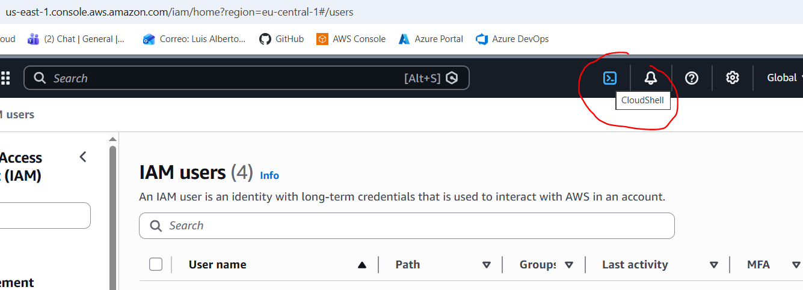
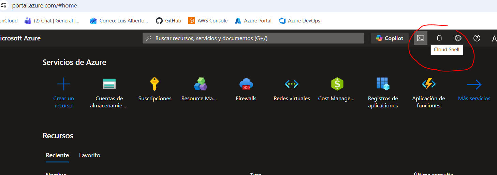
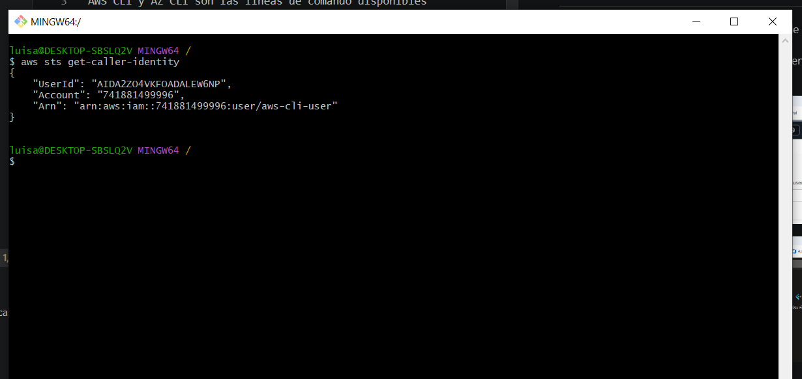

# CLIs para Cloud

AWS CLI y AZ CLI son las lineas de comando disponibles para operar con los entornos de Cloud de AWS y Azure.

## Uso

Existen dos localizaciones fundamentales desde las que se pueden usar:

- Desde los propios entornos de Cloud, dentro de cada consola, haciendo uso de las *CloudShells*

  

  

- Desde entorno locales o remotos, haciendo uso de los CLIs instalados

  

## Autenticación

Para autenticarse contra el CLI, dos opciones:

- Usar un usuario (IAM user, Entra ID user) existente y hacer `aws login` o `az login`. Nos auntenticaremos con la consola de AWS o Azure como si fuera un usuario de consola. Ver [aquí](https://docs.aws.amazon.com/cli/latest/userguide/cli-configure-sign-in.html) para más información.
- **SOLO EN AWS** - Crear un `usuario IAM` y un `par de credenciales AKSK` y añadirlas al fichero de configuración en `.aws/credentials` del perfil correspondiente. Ver [aquí](https://docs.aws.amazon.com/cli/latest/userguide/cli-authentication-user.html) para más información.

> [!IMPORTANT]
> En entornos productivos, deberiamos evitar el uso de usuarios adicionales y utilizar los usuarios federados!
